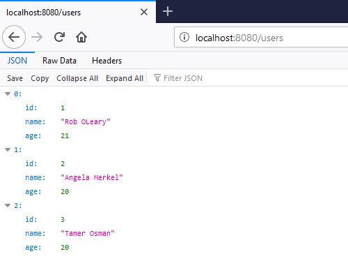

# From 'A' to 'Web App': Build an API in Java

I wrote [this tutorial](https://www.roboleary.net/java/2020/06/03/spring-boot-api.html) to fill a void that I have noticed. Building web applications is a top priority for people learning backend development, but I haven’t seen any Java or Spring Boot tutorials that is friendly for beginners. Most tutorials are either too trivial ([Hello World API](http://spring.io/guides/gs/rest-service/)) to help you understand what you need to know; or they are overwhelming and assume too much about what you already know!

The [second part of the tutorial](https://www.roboleary.net/testing/2020/06/15/api-testing.html) covers testing this web service. The corresponding code is contained in the "with-tests" branch, the code differs slightly from the "master" branch, and includes the unit tests discussed.
  
## What you’ll build

You’ll build a web service that can create, read, update, and delete users.

The default local address for your Spring Boot application will be: [http://localhost:8080](http://localhost:8080),
so the address to get all users would be [http://localhost:8080/users](http://localhost:8080/users) for example.

We will create the following actions:

 <table class="tg">
   <tbody><tr>
     <th class="tg-yw4l">HTTP Method</th>
     <th class="tg-yw4l">Address</th>
     <th class="tg-yw4l">Action</th>
   </tr>
   <tr>
     <td class="tg-yw4l">GET</td>
     <td class="tg-yw4l">/users</td>
     <td class="tg-yw4l">Get all users</td>
   </tr>
   <tr>
     <td class="tg-yw4l">GET</td>
     <td class="tg-yw4l">/users/{id}</td>
     <td class="tg-yw4l">Get users by id</td>
   </tr>
   <tr>
     <td class="tg-yw4l">GET</td>
     <td class="tg-yw4l">/users?name=rob+oleary</td>
     <td class="tg-yw4l">Get user by name</td>
   </tr>
   <tr>
     <td class="tg-yw4l">POST</td>
     <td class="tg-yw4l">/users</td>
     <td class="tg-yw4l">Add a new user</td>
   </tr>
   <tr>
     <td class="tg-yw4l">PUT</td>
     <td class="tg-yw4l">/users</td>
     <td class="tg-yw4l">Update a user</td>
   </tr>
   <tr>
     <td class="tg-yw4l">DELETE</td>
     <td class="tg-yw4l">/users/{id}</td>
     <td class="tg-yw4l">Delete a user</td>
   </tr>
 </tbody>
 </table>

 [The tutorial](https://www.roboleary.net/java/2020/06/03/spring-boot-api.html) outlines prerequisites and provides a step-by-step guide to building the web serivce.

## Show appreciation

If the tutorial was helpful, please star the repo 🌟, and recommend it to others.

You can show your appreciation by [buying me a coffee or sponsoring me](https://ko-fi.com/roboleary). This will offer me encouragement to continue making educational content like this.

